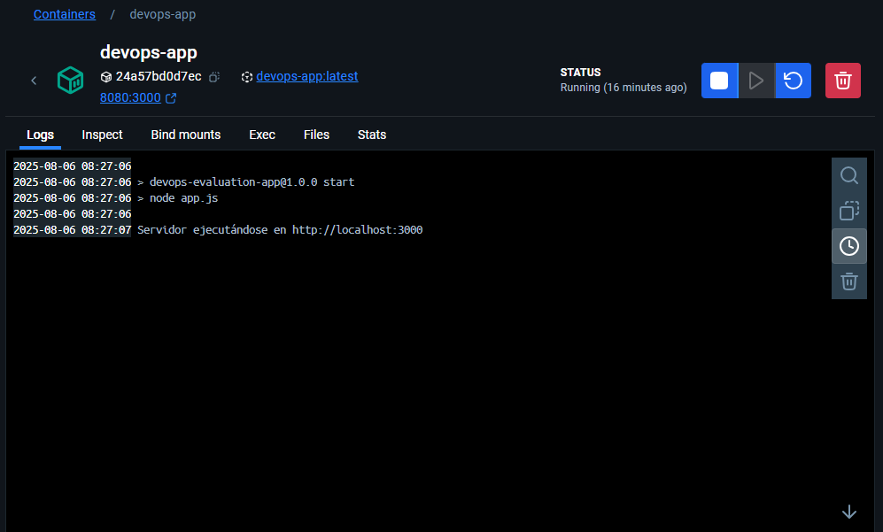
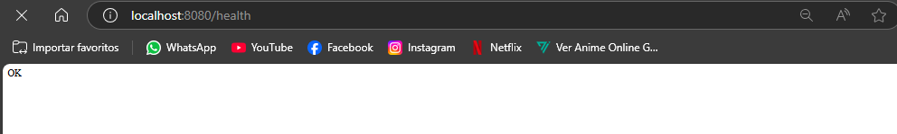

# ArquitecturaSFV-P1

# Evaluación Práctica - Ingeniería de Software V

## Información del Estudiante

- **Nombre:** Andrés David Parra García
- **Código:** A00395676
- **Fecha:** 06/07/2025

## Resumen de la Solución

Se implementa la dockerización de una aplicación Node.js proporcionada. Se creó un Dockerfile para containerizar la aplicación y un script de automatización para facilitar el despliegue y verificación del funcionamiento.

## Dockerfile

### Decisiones tomadas en la creación del Dockerfile:

1. **Imagen base**: `node:20-alpine` 
   - **Razón**: Se seleccionó una versión específica (20) en lugar de `latest` para garantizar estabilidad y reproducibilidad
   - Alpine es una versión más liviana que reduce el tamaño de la imagen

2. **Orden de las instrucciones**:
   - Se copia primero `package.json` y se instalan las dependencias
   - Luego se copia el resto del código
   - **Beneficio**: Docker puede reutilizar las dependencias si solo cambia el código

3. **Variables de entorno**:
   - `NODE_ENV=production`: Configura la aplicación para producción
   - `PORT=3000`: Define el puerto por defecto
   - Estas variables se pueden cambiar al ejecutar el contenedor

4. **Puerto**: Se expone el puerto 3000 fijo en el Dockerfile

## Script de Automatización

El archivo `production.sh` automatiza todo el proceso de despliegue:

### Funcionalidades implementadas:

1. **Verificación de Docker**: Revisa que Docker esté instalado y funcionando

2. **Limpieza**: Elimina contenedores anteriores para evitar conflictos

3. **Construcción**: Construye la imagen Docker y verifica que no haya errores

4. **Ejecución**: Inicia el contenedor en segundo plano mapeando el puerto 8080 al 3000

5. **Verificación**: Hace pruebas automáticas al endpoint `/health` para confirmar que la aplicación funciona

## Principios DevOps Aplicados

1. **Automatización**:
   - Script que automatiza todo el proceso de build y deploy
   - Verificaciones automáticas del funcionamiento

2. **Containerización**:
   - La aplicación funciona igual en cualquier sistema que tenga Docker
   - Aislamiento de dependencias y configuración

3. **Monitoreo básico**:
   - Endpoint `/health` para verificar el estado de la aplicación
   - Logs del contenedor para manejo de errores

## Captura de Pantalla





## Mejoras Futuras

1. **Seguridad**: Escaneo de vulnerabilidades en la imagen

2. **CI/CD completo**: Pipeline en GitHub Actions/GitLab CI

3. **Alta disponibilidad**: Orquestación con Kubernetes y/o Load balancer y auto-scaling

## Instrucciones para Ejecutar

### Variables de Entorno

Esta aplicación usa las siguientes variables de entorno:

- `PORT`: Puerto donde correrá la aplicación (default: 3000)
- `NODE_ENV`: Entorno de ejecución (development, production)

### Opción 1: Script de automatización

```bash
# Ejecutar el 
chmod +x production.sh
./production.sh
```

### Opción 2: Docker tradicional

```bash
# Construir la imagen
docker build -t devops-app .

# Ejecutar con variables por defecto
docker run -p 3000:3000 devops-app

# Ejecutar con variables personalizadas
docker run -p 3000:3000 -e NODE_ENV=development -e PORT=3000 devops-app

# Ejecutar con archivo .env
docker run -p 3000:3000 --env-file .env devops-app
```

### Opción 3: Ejecución local

```bash
npm install
npm start
```

La aplicación estará disponible en: http://localhost:3000
